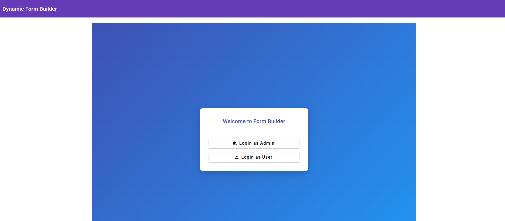
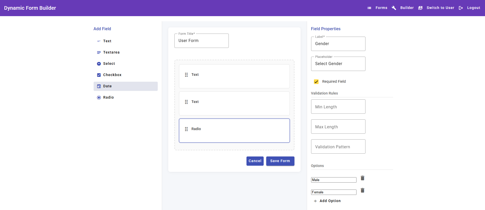
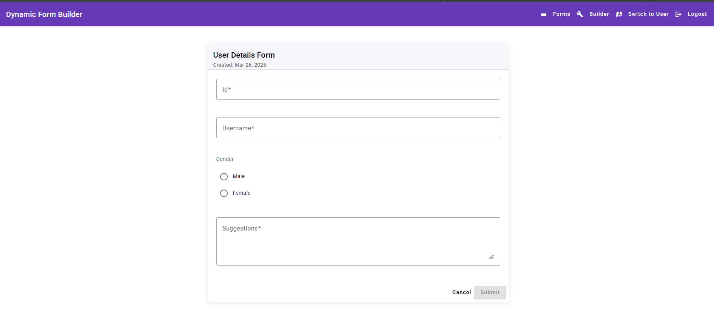
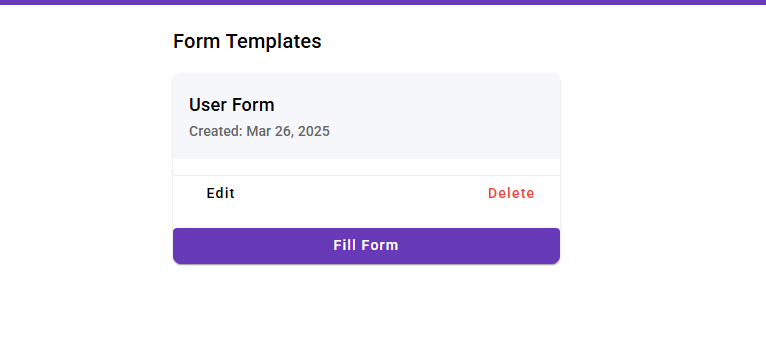

# Dynamic Form Builder

A role-based dynamic form builder with Angular and NgRx state management.


## Key Features

✅ **Implemented**
- Drag-and-drop form builder with 5 field types which can be dragged and dropped as per the order we want
- Role-based access control (Admin/User)
- Form template management (Create/Delete)
- Form submission system with validation
- Basic responsive layout
- Mock API service

⏳ **Partially Implemented**
- **Edit Functionality** 
  - *Current State:* Delete implemented, edit scaffolding in place  
  - *Implementation Plan:*
    ```typescript
    // 1. Edit route with form ID parameter
    { path: 'builder/:id', component: FormBuilderComponent }
    
    // 2. Load existing form in builder
    this.store.select(selectFormById(id)).pipe(
      tap(form => this.patchFormValues(form))
    );
    
    // 3. Update NgRx store on save
    dispatch(updateForm({ updatedForm }));

- **Advanced Responsiveness**
  - *Current State:* Basic media queries implemented
  - *Planned Enhancements:*
    - Mobile-optimized drag handles
    - Collapsible property panels
    - Touch-friendly form previews

## Screenshots

## Application Screenshots

### 1. Form Builder Landing Page


### 2. Form Builder in Action


### 3. Form Filling Interface


### 4. Forms List

